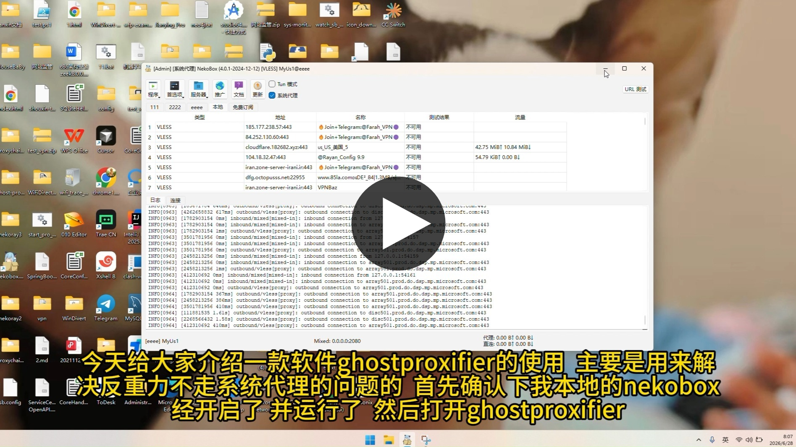

<!-- LOGO & CONTACT -->
<p align="right">
  <a href="https://qun.qq.com/universal-share/share?ac=1&authKey=jLD98s%2BuMM87y8zEcP6tBhrYEyCh2H9gnwigYoYoNLIjY4XqRWTFT0cmx0QDF4hT&busi_data=eyJncm91cENvZGUiOiI5NDUxMzg0MDgiLCJ0b2tlbiI6Imh0cHlaWUViTURaNXoyNklyMGI1akVIcFI5Q3ZIVEFzYktZTEQyRkUwallRck1tQ0d4SFN1d3haNmVMR0lzL3kiLCJ1aW4iOiIxODcxODE0NzQ5In0%3D&data=iw28-MBoXAQ6Pc8ThvaD6YOIC2xcOqodEkkc4rW6JgVNZWNxS5Ka8rqbOiJFZov5cN1L6atFKQwdpoHkdb34fw&svctype=4&tempid=h5_group_info" target="_blank">QQ Group</a>
  &nbsp;·&nbsp;
  <a href="https://t.me/ghostproxifier" target="_blank">TG Channel</a>
  &nbsp;·&nbsp;
  <a href="https://t.me/+SCVIJJFocWAxN2Y9" target="_blank">TG Group</a>
</p>

<p align="center"></p>

<h1 align="center">Ghost Proxifier Pro</h1>

<p align="center">
  <a href="README.md">🇨🇳 中文</a>
  &nbsp;·&nbsp;
  <a href="https://github.com/liliBestCoder/ghost-proxifier-pro/releases" target="_blank">Download</a>
  &nbsp;·&nbsp;
  <a href="https://ghostproxifier.com" target="_blank">Website</a>
</p>

<p align="center">
  <a href="#core-features">Core Features</a>
  &nbsp;·&nbsp;
  <a href="#supported-apps">Supported Apps</a>
  &nbsp;·&nbsp;
  <a href="#architecture-overview">Architecture</a>
  &nbsp;·&nbsp;
  <a href="#use-cases">Use Cases</a>
  &nbsp;·&nbsp;
  <a href="#comparison">Comparison</a>
  &nbsp;·&nbsp;
  <a href="#quick-start">Quick Start</a>
  &nbsp;·&nbsp;
  <a href="#screenshots">Screenshots</a>
  &nbsp;·&nbsp;
  <a href="#faq">FAQ</a>
</p>

<p align="center">
  A process-level transparent proxy for Windows. It injects a DLL and hooks the Winsock API to route traffic from selected applications and their child processes through an HTTP proxy — without changing routing tables or installing a virtual network adapter.
</p>

<p align="center">
  🔧 <a href="https://github.com/liliBestCoder/ghost-proxifier" target="_blank"><b>Ghost Proxifier Open Source</b></a> — CLI-only, MIT licensed
</p>

<p align="center">
  <b>🎬 Video Tutorial: Ghost Proxifier Basic Usage</b>
</p>

<p align="center">
  <font color="#d93025"><b>⚠️ Important</b></font>
</p>

<blockquote>
<p><font color="#d93025"><b>Make sure the target application and its child processes are fully closed before injection.</b></font><br>
Injection may fail if an existing instance is already running in the background. Fully exit the application before dropping its shortcut or <code>.exe</code> file into the window.</p>

<p><font color="#d93025"><b>About Windows security warnings:</b></font><br>
The project does not yet have a Microsoft code-signing certificate. When downloading the installer through Microsoft Edge, some antivirus software may report a false positive and Windows SmartScreen may block the download or launch.</p>

<p>If Edge blocks the download, open <code>Settings → Privacy, search, and services → Security</code> and temporarily disable “Block potentially unwanted apps and downloads”. Re-enable this setting after downloading the installer.</p>

<p>If SmartScreen still blocks the installer, click <code>More info → Run anyway</code> in the blue warning dialog.</p>

<p>Only do this after confirming that the installer came from the official project Releases page and verifying its source.</p>
</blockquote>

<p align="center">
  <a href="https://www.bilibili.com/video/BV1TkTP61Eyb/" target="_blank">
    
  </a>
</p>

## Use Cases

- Proxy AI coding tools such as Codex, Claude Code, and Antigravity.
- Use multiple VPN or proxy clients together while routing only selected applications to reduce virtual-adapter and routing conflicts.
- Proxy command-line tools, developer tools, and game clients that ignore system proxy settings.
- Assign different proxy nodes to different applications or accounts for network-level IP isolation.

## Core Features

- **Drag and drop**: Drop a shortcut or `.exe` file to inject the target process.
- **Automatic child-process tracking**: Child processes are handled automatically without manual PID configuration.
- **Per-process proxying**: Proxy only selected applications while leaving other system traffic unchanged.
- **Local DNS**: Forward DNS queries through the proxy to reduce DNS leaks and poisoning.
- **DoH / QUIC blocking**: Prevent browsers from bypassing the proxy through direct HTTPS or UDP connections.
- **Live monitoring**: View process status, proxy status, traffic statistics, and automatic reconnection.

## Supported Apps

<table width="100%" style="table-layout: fixed;">
  <tr>
    <td align="center" width="10%"><br><sub>Chrome</sub></td>
    <td align="center" width="10%"><br><sub>MS Edge</sub></td>
    <td align="center" width="10%"><br><sub>Firefox</sub></td>
    <td align="center" width="10%"><br><sub>Claude Desktop</sub></td>
    <td align="center" width="10%"><br><sub>Claude Code</sub></td>
    <td align="center" width="10%"><br><sub>Codex</sub></td>
    <td align="center" width="10%"><br><sub>Antigravity</sub></td>
    <td align="center" width="10%"><br><sub>Node.js</sub></td>
    <td align="center" width="10%"><br><sub>Python</sub></td>
    <td align="center" width="10%"><br><sub>SSH</sub></td>
  </tr>
  <tr>
    <td align="center"><br><sub>FinalShell</sub></td>
    <td align="center"><br><sub>Xshell</sub></td>
    <td align="center"><br><sub>MySQL Workbench</sub></td>
    <td align="center"><br><sub>BlueStacks X</sub></td>
    <td align="center"><br><sub>CMD</sub></td>
    <td align="center"><br><sub>PowerShell</sub></td>
    <td align="center"><br><sub>CrossFire</sub></td>
    <td align="center"><br><sub>HyperDown</sub></td>
    <td align="center"><sub>...</sub></td>
  </tr>
</table>

> In theory, all Windows applications using Winsock are supported. The list above contains tested and verified applications.

## Architecture Overview

```text
                        Ghost Proxifier Pro Architecture
┌─────────────────────────────────────────────────────────────────────────────┐
│                        Target Process (e.g. Chrome)                         │
│                                                                             │
│  ┌──────────┐   ┌──────────┐   ┌──────────┐   ┌─────────────────────────┐  │
│  │ DNS Query │   │ TCP Connect│  │ Data Send │   │ 8.8.8.8:53             │  │
│  │          │   │          │   │          │   │                         │  │
│  │ getaddrinfo│   │ connect()│   │ send() / │   │ sendto(53)             │  │
│  │GetAddrInfoW│   │ConnectEx()│  │WSASend() │   │WSASendTo()             │  │
│  └────┬─────┘   └────┬─────┘   └────┬─────┘   └────┬──────────────────┘  │
│       │              │              │              │                       │
│       └──────┬───────┘              │              │                       │
│              │                      │              │                       │
│         ┌────┴─────┐           ┌────┴─────┐   ┌────┴─────┐                 │
│         │  HOOK    │           │  HOOK    │   │  HOOK    │                 │
│         └────┬─────┘           └────┬─────┘   └────┬─────┘                 │
│              │                      │              │                       │
│         ┌────┴─────┐           ┌────┴─────┐   ┌────┴─────┐                 │
│         │ Local DNS │           │ Redirect to  │   │ Lazy Handshake       │
│         │ Proxy     │           │ Proxy, Save  │   │ 1. Check PendingMap  │
│         │ UDP → TCP │           │ to PendingMap│   │ 2. HTTP CONNECT      │
│         │ Forward to│           │              │   │ 3. Send original data│
│         │ 8.8.8.8:53│           │              │   │                      │
│         └────────────┘           └──────────┘   └─────────────────────────┘
│                                                                             │
│                   ghost_core.dll (injected into target process)              │
└─────────────────────────────────────────────────────────────────────────────┘
                   │                       │
                   │   127.0.0.1:2080      │
                   │                       │
            ┌──────┴───────┐      ┌────────┴────────┐
            │  Upstream     │      │  DNS Results    │
            │  HTTP CONNECT │      │                 │
            │  Proxy        │      │  IP → Hostname  │
            │ (V2Ray/Clash/ │      │                 │
            │  NekoBox/...) │      │                 │
            └──────────────┘      └─────────────────┘
```

No TUN/TAP virtual adapter or WFP kernel driver is required. Ghost Proxifier uses user-mode API Hooking based on MinHook to intercept Winsock functions and take over only selected processes and their child processes.

## Comparison

| Feature | Ghost Proxifier Pro | Proxifier | ProxyBridge | Antigravity-Proxy |
| :--- | :---: | :---: | :---: | :---: |
| GUI and drag-and-drop | ✅ | ⚠️ Rules required | ⚠️ Rules required | ❌ |
| Automatic child-process tracking | ✅ | ⚠️ Rule matching | ⚠️ Rule matching | ❌ |
| Virtual adapter/driver required | ❌ | ⚠️ WFP driver | ⚠️ WinDivert driver | ❌ |
| Application scope | ✅ General multi-app | ✅ General multi-app | ✅ General multi-app | ⚠️ Mainly single-app |
| DNS / DoH / QUIC handling | ✅ Built in | ⚠️ Extra configuration | ⚠️ Extra configuration | ❌ |

## Quick Start

1. Download and launch Ghost Proxifier Pro from [Releases](https://github.com/liliBestCoder/ghost-proxifier-pro/releases).
2. Configure the upstream HTTP proxy and DNS settings.
3. Drop the target shortcut or `.exe` file into the window and start the proxied process.

### Support the Project

If Ghost Proxifier is useful to you, you can support the project via WeChat or PayPal. Your support helps fund ongoing development, maintenance, and operation of the software:

<p align="center">
  
  &nbsp;&nbsp;&nbsp;
  
</p>

## Screenshots


## FAQ

**Is Ghost Proxifier Pro free?**

The Pro version is currently free to use, including drag-and-drop injection, multi-application proxying, and child-process tracking.

**What is the difference between Pro and the open-source version?**

The Pro version provides a GUI, process rules, traffic monitoring, automatic child-process tracking, Watchdog reconnection, and an installer. The open-source version is CLI-only.

**How can I report an issue?**

Please use [GitHub Issues](https://github.com/liliBestCoder/ghost-proxifier-pro/issues) or contact us through the official communities.

## Community

- [QQ Group 945138408](https://qun.qq.com/universal-share/share?ac=1&authKey=jLD98s%2BuMM87y8zEcP6tBhrYEyCh2H9gnwigYoYoNLIjY4XqRWTFT0cmx0QDF4hT&busi_data=eyJncm91cENvZGUiOiI5NDUxMzg0MDgiLCJ0b2tlbiI6Imh0cHlaWUViTURaNXoyNklyMGI1akVIcFI5Q3ZIVEFzYktZTEQyRkUwallRck1tQ0d4SFN1d3haNmVMR0lzL3kiLCJ1aW4iOiIxODcxODE0NzQ5In0%3D&data=iw28-MBoXAQ6Pc8ThvaD6YOIC2xcOqodEkkc4rW6JgVNZWNxS5Ka8rqbOiJFZov5cN1L6atFKQwdpoHkdb34fw&svctype=4&tempid=h5_group_info)
- [Telegram Channel @ghostproxifier](https://t.me/ghostproxifier)
- [Telegram Group](https://t.me/+SCVIJJFocWAxN2Y9)
