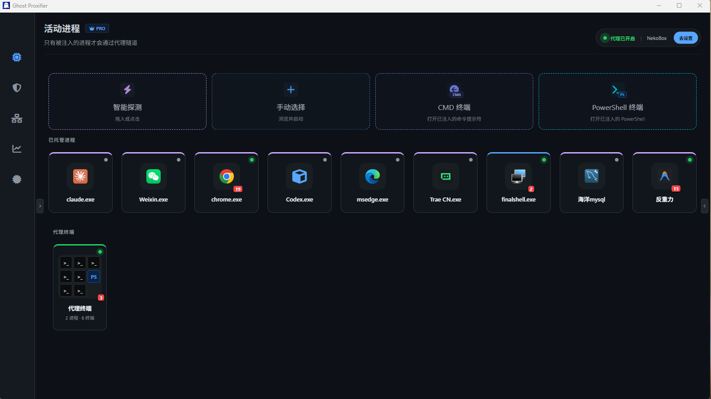
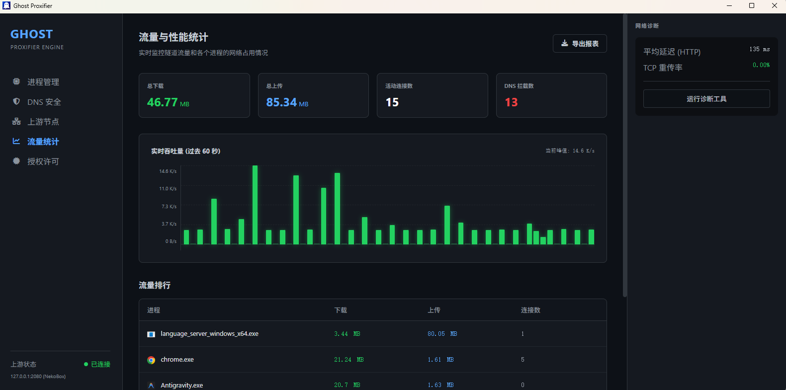
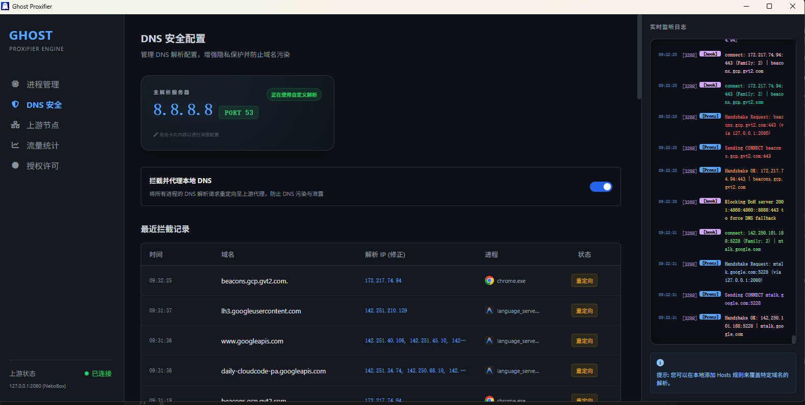
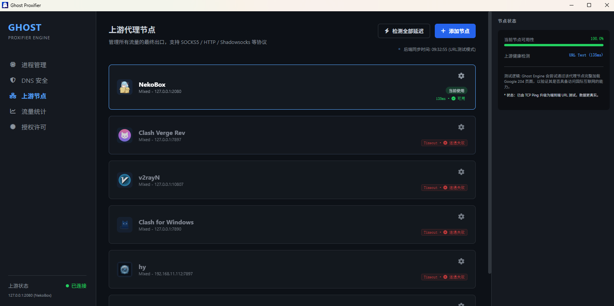

<!-- LOGO & CONTACT -->
<p align="right">
  <a href="https://qun.qq.com/universal-share/share?ac=1&authKey=jLD98s%2BuMM87y8zEcP6tBhrYEyCh2H9gnwigYoYoNLIjY4XqRWTFT0cmx0QDF4hT&busi_data=eyJncm91cENvZGUiOiI5NDUxMzg0MDgiLCJ0b2tlbiI6Imh0cHlaWUViTURaNXoyNklyMGI1akVIcFI5Q3ZIVEFzYktZTEQyRkUwallRck1tQ0d4SFN1d3haNmVMR0lzL3kiLCJ1aW4iOiIxODcxODE0NzQ5In0%3D&data=iw28-MBoXAQ6Pc8ThvaD6YOIC2xcOqodEkkc4rW6JgVNZWNxS5Ka8rqbOiJFZov5cN1L6atFKQwdpoHkdb34fw&svctype=4&tempid=h5_group_info" target="_blank">QQ群</a>
  &nbsp;·&nbsp;
  <a href="https://t.me/ghostproxifier" target="_blank">TG频道</a>
  &nbsp;·&nbsp;
  <a href="https://t.me/+SCVIJJFocWAxN2Y9" target="_blank">TG群组</a>
</p>

<p align="center">
  
</p>

<h1 align="center">Ghost Proxifier Pro</h1>

<p align="center">
  <a href="README-EN.md">🇬🇧 English</a>
  &nbsp;·
  <a href="https://github.com/liliBestCoder/ghost-proxifier-pro/releases" target="_blank">Download</a>
  &nbsp;·
  <a href="https://ghostproxifier.com" target="_blank">Website</a>
</p>

<p align="center">
  <a href="#已支持应用">已支持应用</a>
  ·
  <a href="#主要应用场景">主要应用场景</a>
  ·
  <a href="#解决了什么问题">解决了什么问题</a>
  ·
  <a href="#架构">架构</a>
  ·
  <a href="#原理">原理</a>
  ·
  <a href="#特性">特性</a>
  ·
  <a href="#与同类工具对比">与同类工具对比</a>
  ·
  <a href="#使用">使用</a>
  ·
  <a href="#运行截图">运行截图</a>
  ·
  <a href="#faq">FAQ</a>
</p>

<p align="center">
  进程级透明代理引擎 — 通过 DLL 注入 Hook Winsock API，将目标进程的所有网络流量透明转发到 HTTP 代理。无需修改路由表，无需安装虚拟网卡，代理节点对应用完全不可见。
</p>

<p align="center">
  🔧 <a href="https://github.com/liliBestCoder/ghost-proxifier" target="_blank"><b>Ghost Proxifier (开源版)</b></a> — 纯命令行工具，MIT 开源，适合 DIY 和二次开发
</p>

## 已支持应用

<table width="100%" style="table-layout: fixed;">
  <tr>
    <td align="center" width="10%"><br><sub>Chrome</sub></td>
    <td align="center" width="10%"><br><sub>MS Edge</sub></td>
    <td align="center" width="10%"><br><sub>Firefox</sub></td>
    <td align="center" width="10%"><br><sub>Claude Desktop</sub></td>
    <td align="center" width="10%"><br><sub>Claude Code</sub></td>
    <td align="center" width="10%"><br><sub>Codex</sub></td>
    <td align="center" width="10%"><br><sub>Antigravity</sub></td>
    <td align="center" width="10%"><br><sub>Node.js</sub></td>
    <td align="center" width="10%"><br><sub>Python</sub></td>
    <td align="center" width="10%"><br><sub>SSH</sub></td>
  </tr>
  <tr>
    <td align="center"><br><sub>FinalShell</sub></td>
    <td align="center"><br><sub>Xshell</sub></td>
    <td align="center"><br><sub>MySQL Workbench</sub></td>
    <td align="center"><br><sub>BlueStacks X</sub></td>
    <td align="center"><br><sub>CMD</sub></td>
    <td align="center"><br><sub>PowerShell</sub></td>
    <td align="center"><br><sub>CF (穿越火线)</sub></td>
    <td align="center"><sub>...</sub></td>
  </tr>
</table>

> 理论上支持所有使用 Winsock 的 Windows 应用。以上为测试验证过的应用列表，更多应用持续验证中。

## 主要应用场景

* AI 编程 / Vibe Coding 加速：接管 Codex、Claude Code、Antigravity、Cursor 等 AI 工具流量，解决 API 超时与连接重置。
* 出海业务多账号防关联：按进程分配独立 IP/代理节点，实现跨境电商与海外社媒多账号物理隔离防封。（注：仅能实现网络 IP 级别的隔离，无法实现浏览器指纹级别的隔离）
* VPN 与代理并行办公：解决企业 VPN 连内网与代理翻墙的路由表冲突，按需代理指定应用，互不干扰。
* 命令行与开发工具代理：透明接管 CMD、PowerShell、FinalShell、Xshell、MySQL Workbench 等不走系统代理的软件。
* 游戏客户端与软件独占加速：支持为指定游戏客户端或独立软件分配专属代理节点，避免全局代理带来的高延迟与流量浪费。

## 解决了什么问题？

### 应用不走系统代理

Chrome 还算听话，但 Telegram、Antigravity、各种游戏启动器——它们根本不理 Windows 的代理设置。Ghost Proxifier 直接进入进程内部，在 Winsock 层面接管网络请求，强制走你指定的代理。**流量不会泄露。**

### VPN 和代理不能同时开

公司 VPN 连着内网，Clash 想翻墙——路由表打架，总有一个断。TUN 模式下虚拟网卡与 VPN 网卡频繁切换，内核态/用户态切换带来额外延迟。

Ghost Proxifier **不装虚拟网卡，不改路由表**。只代理你选中的进程，其它流量纹丝不动。VPN、内网、代理可以同时在线，互不干扰。

### 子进程裸奔

你拖入了启动器，它 spawn 出十个子窗口——那些子窗口的流量直接走真实 IP，代理形同虚设。Pro 版自动追踪进程树，一次拖入，整个进程家族全部接管。

## 架构

```
                           Ghost Proxifier Pro 架构
┌─────────────────────────────────────────────────────────────────────────────┐
│                         目标进程 (e.g. Chrome)                               │
│                                                                             │
│  ┌──────────┐   ┌──────────┐   ┌──────────┐   ┌─────────────────────────┐  │
│  │ DNS 查询  │   │ TCP 连接  │   │ 数据发送  │   │ 8.8.8.8:53             │  │
│  │          │   │          │   │          │   │                         │  │
│  │ getaddrinfo│   │ connect()│   │ send() / │   │ sendto(53)             │  │
│  │GetAddrInfoW│   │ConnectEx()│  │WSASend() │   │WSASendTo()             │  │
│  └────┬─────┘   └────┬─────┘   └────┬─────┘   └────┬──────────────────┘  │
│       │              │              │              │                       │
│       └──────┬───────┘              │              │                       │
│              │                      │              │                       │
│         ┌────┴─────┐           ┌────┴─────┐   ┌────┴─────┐                 │
│         │  HOOK    │           │  HOOK    │   │  HOOK    │                 │
│         └────┬─────┘           └────┬─────┘   └────┬─────┘                 │
│              │                      │              │                       │
│         ┌────┴─────┐           ┌────┴─────┐   ┌────┴─────┐                 │
│         │ Local DNS │           │ 重定向到代理 │   │ Lazy Handshake        │
│         │ Proxy     │           │ 保存目标到  │   │ 1. 检查 PendingMap    │
│         │ UDP → TCP │           │ PendingMap │   │ 2. HTTP CONNECT       │
│         │ 转发到     │           │           │   │ 3. 发送原始数据        │
│         │ 8.8.8.8:53│           │           │   │                       │
│         └────────────┘           └──────────┘   └─────────────────────────┘
│                                                                             │
│                    ghost_core.dll (注入到目标进程)                            │
└─────────────────────────────────────────────────────────────────────────────┘
                   │                       │
                   │   127.0.0.1:2080      │
                   │                       │
            ┌──────┴───────┐      ┌────────┴────────┐
            │ 上游 HTTP     │      │  DNS 解析结果   │
            │  CONNECT 代理  │      │                 │
            │ (V2Ray/Clash/ │      │   IP → 域名     │
            │  NekoBox/...) │      │                 │
            └──────────────┘      └─────────────────┘
```

不装 TUN/TAP 虚拟网卡——那会被风控系统检测。不走 WFP 内核驱动——那需要 EV 证书签名。我们的路径是 **用户态 API Hook**，基于 MinHook 深度拦截 Winsock API 25+ 个函数。C++17 编写，极低内存占用，毫秒级注入完成。

## 原理

### 1. HTTP CONNECT 代理协议

Ghost Proxifier 使用标准 **HTTP CONNECT** 方法与上游代理建立隧道：

```text
# 解析到域名时
CONNECT www.google.com:443 HTTP/1.1\r\nHost: www.google.com:443\r\n\r\n

# 解析不到域名时 (fallback)
CONNECT 142.251.45.10:443 HTTP/1.1\r\nHost: 142.251.45.10:443\r\n\r\n
```

代理返回 `HTTP/1.1 200 Connection Established\r\n\r\n` 后，隧道建立，开始双向数据转发。

`connect()` 拿到的目标是 **IP 地址**而非域名。Ghost Proxifier 通过 DNS 阶段建立的 **IP → 域名** 映射表，优先使用域名发起 CONNECT，让上游代理能做域名级路由分流。解析不到域名时 fallback 到 IP，此时上游可借助 GeoIP 规则调度。因此 **Local DNS 防污染** 至关重要。

### 2. 延迟握手（Lazy Handshake）

Chrome 等浏览器使用非阻塞 IO + 完成端口。如果在 `connect()` 阶段同步等待代理握手，会触发浏览器的卡死检测。

Ghost Proxifier 的解决方案：

| 阶段 | 操作 | 阻塞？ |
|------|------|--------|
| `connect()` | 重定向到代理地址，保存目标到 PendingMap | ❌ 非阻塞 |
| 等待连接 | 应用事件循环正常运行 | ❌ |
| `send()` 首次调用 | 从 PendingMap 取出目标，完成 HTTP CONNECT | ✅ 短暂 (< 5ms) |
| 后续 `send()` | 直接转发 | ❌ |

`connect()` 立即返回成功，应用以为连接已建立。真正的代理握手推迟到首次 `send()` 时完成，对应用完全透明。

### 3. 内置 Local DNS

系统 DNS 存在两个核心问题：
- **DNS 泄露** — ISP 可看到你的所有 DNS 查询
- **DNS 污染** — GFW 投毒返回虚假 IP，导致连接被重置

Ghost Proxifier 的 DNS 流程：

```
应用 DNS 查询 (UDP)
    ↓ Hook 拦截
Local DNS Proxy (127.0.0.1:随机端口)
    ↓ UDP → TCP 转换
通过代理隧道 CONNECT 到 8.8.8.8:53
    ↓ TCP DNS 查询
Google DNS 返回真实结果
    ↓ 记录 IP → 域名 映射（供 connect 阶段使用）
```

DNS 查询走加密代理隧道，杜绝 ISP 偷窥和 GFW 投毒。返回的 IP→域名映射表配合上游 GeoIP/GeoSite 分流规则，确保流量走最优路线。

### 4. DoH 阻断

Chrome 等浏览器默认启用 DNS-over-HTTPS（DoH），通过 HTTPS 直连 `8.8.8.8:443`、`1.1.1.1:443` 等 DoH 服务器，绕过了 Local DNS Proxy。

Ghost Proxifier 识别已知 DoH 服务器 IP，在 `connect()` 阶段直接返回 `WSAECONNREFUSED`，强制浏览器回退到标准 DNS：

```
Chrome → connect(8.8.8.8:443)  → DoH 请求
              ↓ Hook 识别为 DoH 服务器
          返回 WSAECONNREFUSED
              ↓ Chrome 回退
Chrome → sendto(8.8.8.8:53)   → 标准 DNS → 被 Local DNS Proxy 接管 ✅
```

### 5. QUIC 阻断

QUIC（HTTP/3）基于 UDP 443，同样会绕过代理。Ghost Proxifier 在 `sendto`/`WSASendTo` 和 `recvfrom`/`WSARecvFrom` 全路径阻断 UDP 443 流量，返回 `WSAENETUNREACH`，触发浏览器 TCP fallback（HTTP/2 或 HTTP/1.1），从而走 HTTP CONNECT 隧道。

## 特性

### 进程树自动追踪

拖入一个主进程，引擎自动识别并注入它创建的所有子进程。Chrome 的 Network Service、GPU Process、Utility Process——全部自动覆盖，不需要手动配置 PID。

内置 Watchdog 实时检测 Hook 状态，网络波动导致代理断开时自动重连。

### 流量可视化

玻璃拟态 UI + 暗黑模式。实时流量图表、进程级网络拓扑、状态指示灯（绿/黄/红）。每 2 秒刷新，流畅不抖动。

### DNS 防污染 + DoH 阻断

内置 Local DNS，DNS 查询走加密隧道，杜绝 ISP 投毒。同时阻断 Chrome 等浏览器的 DoH 直连，强制所有 DNS 走本地代理，确保上游的 GeoIP/GeoSite 分流规则拿到的是真实 IP。

## 与同类工具对比

| 核心维度 | Ghost Proxifier Pro | Proxifier | ProxyBridge | Antigravity-Proxy |
| :--- | :---: | :---: | :---: | :---: |
| **易用性与维护** | ✅ 现代 GUI (拖拽即用，软件更新无需重新配置) | ⚠️ 经典旧版 GUI (需繁琐配置规则) | ⚠️ GUI / CLI (需配置规则与驱动) | ❌ 需手动拷贝 DLL 到指定目录 (软件更新后失效需重新配置) |
| **进程树自动追踪** | ✅ 动态自动接管并注入所有子进程 | ⚠️ 仅能基于规则/进程名匹配 | ⚠️ 仅能基于规则/进程名匹配 | ❌ 仅支持覆盖单个目标文件 |
| **网络与 DNS 防泄露** | ✅ **零泄露** (内置 Local DNS + DoH/QUIC 主动阻断) | ⚠️ 存在 UDP / DoH 泄露风险 (需额外配置防火墙) | ⚠️ 存在 DNS / DoH 泄露风险 | ❌ 无法拦截 DoH / QUIC 导致流量泄露 |
| **内核驱动要求** | ❌ 无需驱动 (纯用户态 API Hook) | ⚠️ 需安装 WFP 系统驱动 | ⚠️ 需安装 WinDivert 驱动 | ❌ 无需驱动 (纯用户态) |
| **适用软件范围** | ✅ 通用多应用 | ✅ 通用多应用 | ✅ 通用多应用 | ⚠️ 仅专为 Antigravity 针对性开发 |
| **TCP / UDP 协议支持** | ⚠️ 仅支持 TCP 代理 (DoH/QUIC 阻断 + DNS over TCP) | ⚠️ 仅支持 TCP 代理 (UDP 存在泄露风险) | ✅ 支持 TCP & UDP 包重定向 | ⚠️ 仅支持 TCP 代理 (UDP 存在泄露风险) |

## 使用

通过 Pro 版图形界面操作：拖入或手动选择目标进程快捷方式或exe即可自动注入，引擎会自动识别并注入该进程及其所有子进程。主界面提供进程列表、代理状态、流量统计等实时信息。

上游代理节点、DNS 服务器、注入规则等所有配置均在图形界面中完成，无需手动编辑配置文件。

> ⚠️ <font color="#ff3333"><b>重要使用注意事项：</b></font><br>
> <font color="#ff3333">拖入快捷方式或 <code>.exe</code> 文件前，请确保系统后台<b>没有该目标程序的正在运行实例</b>。若已有同名进程在后台运行，拖入后代理注入将无法生效（状态指示灯不会亮起）。请先完全退出或在任务管理器中结束目标进程后再拖入启动。</font>

## 运行截图









## FAQ

**Ghost Proxifier 收费吗？**

不收费。Ghost Proxifier 现已完全免费，并开放了全部专业版（Pro）高级功能。所有用户都可以无限制地使用拖拽快捷方式注入、无限应用同时代理、不限单次运行与代理时长等全部核心及高级功能，不再有任何进程数量或运行时间的限制。

**和开源版有什么区别？**

Pro 版提供现代化图形 UI、进程规则管理、流量可视化面板、进程树自动追踪、Watchdog 自动重连、MSI 安装包等高级功能。开源版为纯命令行工具。

**如何反馈问题？**

如您在安装或使用过程中遇到任何问题，欢迎 [提交 Issue](https://github.com/liliBestCoder/ghost-proxifier-pro/issues) 或通过官方社群联系我们。

## 企业合作与社群联系

如果您的企业在出海运营、跨境电商、游戏代理、研发办公或合规审计等场景下，需要更强大的集中管理功能（如全局配置下发、访问审计与监控、动态访问阻断、专有驱动与协议定制），欢迎联系探讨合作：

- **QQ 交流群**：[**945138408**](https://qun.qq.com/universal-share/share?ac=1&authKey=jLD98s%2BuMM87y8zEcP6tBhrYEyCh2H9gnwigYoYoNLIjY4XqRWTFT0cmx0QDF4hT&busi_data=eyJncm91cENvZGUiOiI5NDUxMzg0MDgiLCJ0b2tlbiI6Imh0cHlaWUViTURaNXoyNklyMGI1akVIcFI5Q3ZIVEFzYktZTEQyRkUwallRck1tQ0d4SFN1d3haNmVMR0lzL3kiLCJ1aW4iOiIxODcxODE0NzQ5In0%3D&data=iw28-MBoXAQ6Pc8ThvaD6YOIC2xcOqodEkkc4rW6JgVNZWNxS5Ka8rqbOiJFZov5cN1L6atFKQwdpoHkdb34fw&svctype=4&tempid=h5_group_info)
- **Telegram 频道**：[@ghostproxifier](https://t.me/ghostproxifier)
- **Telegram 群组**：[Ghost Proxifier](https://t.me/+SCVIJJFocWAxN2Y9)
- **GitHub Issue**：[提交 Bug 或建议](https://github.com/liliBestCoder/ghost-proxifier-pro/issues)
